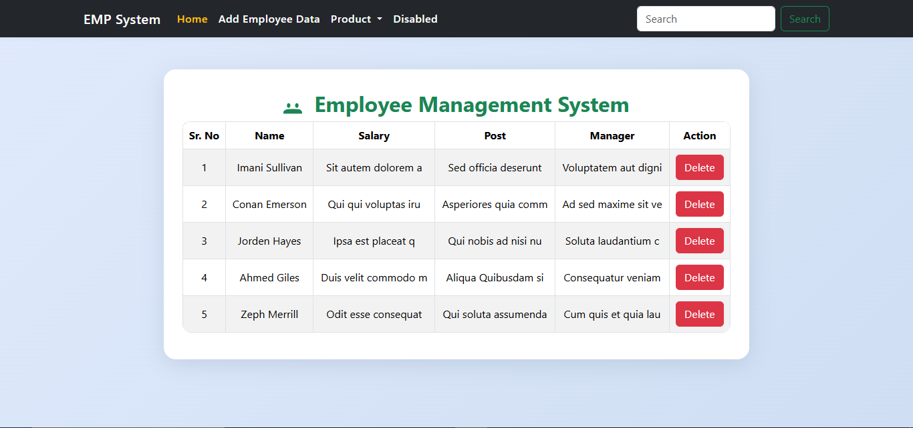
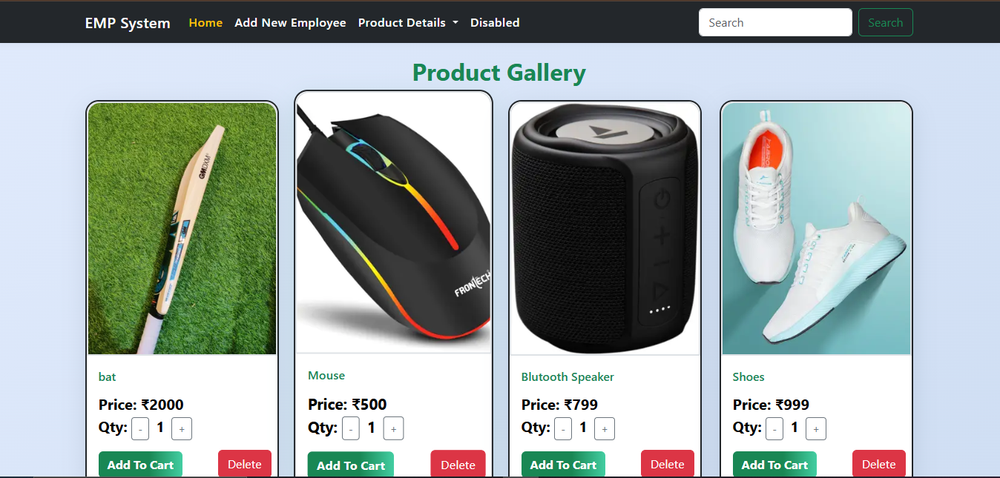

Employee and Product Management system built with using HTML, CSS, Bootstrap and Javascript.

Link : https://pr-repetition-logic-js.vercel.app/

Screenshort: 

1. View Employee

2. Product View

 

Features:

- Add, view, and delete employee records
- Add, view, update quantity, and delete products
- Persistent data storage using browser localStorage
- Responsive UI with Bootstrap
- Product gallery with image support
- Dynamic tables for employee and product management

Tech Stack:

- HTML5
- CSS3 
- Bootstrap 5
- JavaScript
- Vercel for deployment

